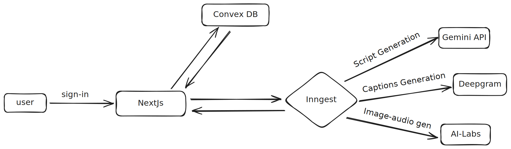

# 🎬 AI Short Video Generator 🤖

Welcome to my **AI Short Video Generator** app — a smart tool that turns text prompts into engaging, short-form videos using the power of artificial intelligence.

---

## 🛠️ Features

- 🎙️ Converts text into AI-narrated videos
- 🖼️ Automatically adds visuals and transitions
- 📱 Perfect for social media shorts and reels
- 🧠 Uses cutting-edge AI models
- 🚀 Clean, user-friendly interface

---

## ⚙️ Tech Stack

1. **Next.js** – Modern React framework for frontend and fullstack routing  
2. **Convex** – Reactive backend-as-a-database for real-time state handling  
3. **Inngest** – Serverless workflows and API orchestration  
4. **Replicate / ai-labs** – For generating visuals and audio using AI models  
5. **Gemini API** – For generating intelligent and dynamic video scripts  
6. **Deepgram** – For high-quality speech-to-text captions  
7. **Remotion** – To stitch audio, visuals, and captions into full HD videos 

## 🏗️ Architecture

## ⚠️❗ Important Note ❗⚠️

> 🟥 **RE-UPLOADED REPOSITORY** 🟥  
>
> I had to **delete the previous repo** because I accidentally committed from my **office email ID**.  
> To avoid any conflicts or privacy concerns, I’ve **recreated this repository** with the same content under my personal GitHub account.

> 🔁 _Same project — clean commit history._